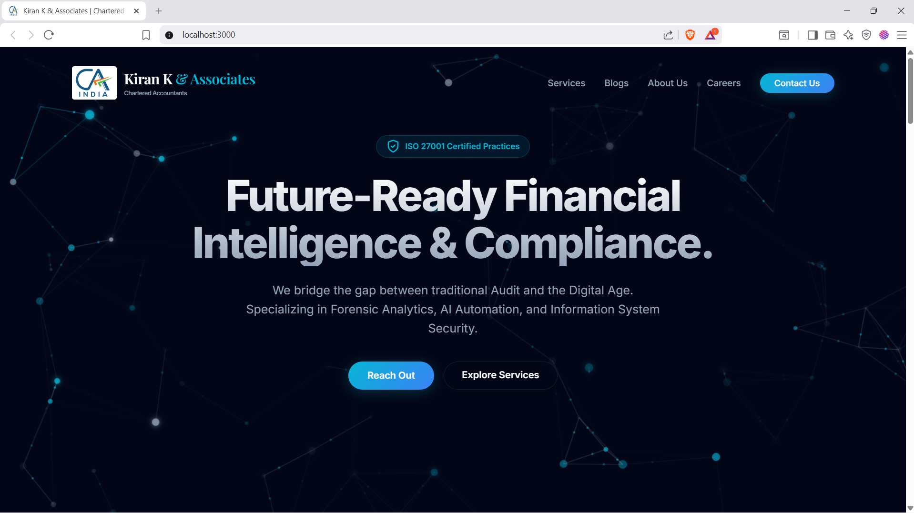
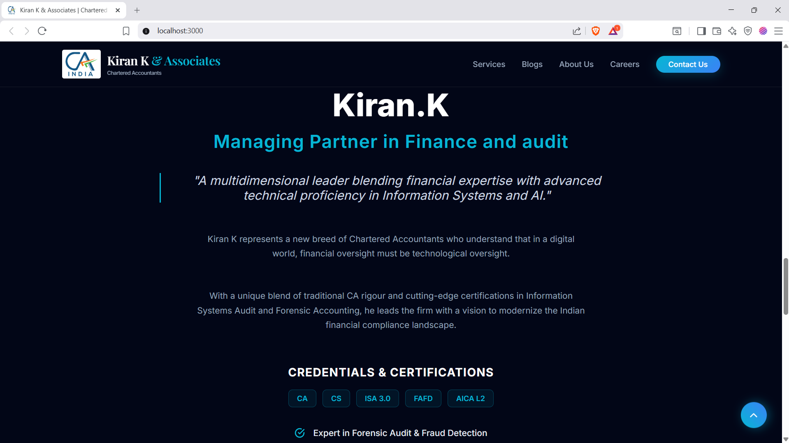
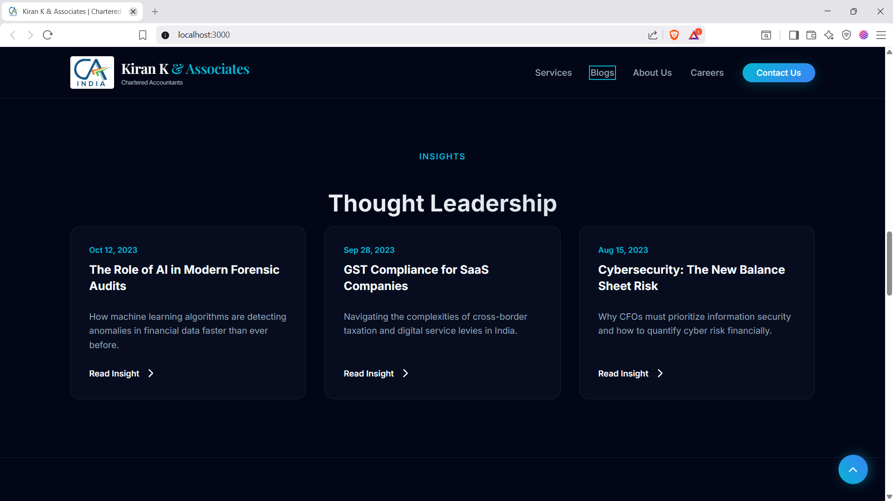
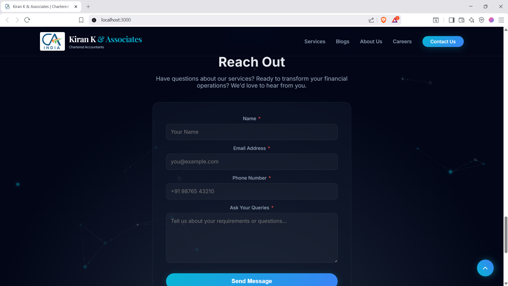
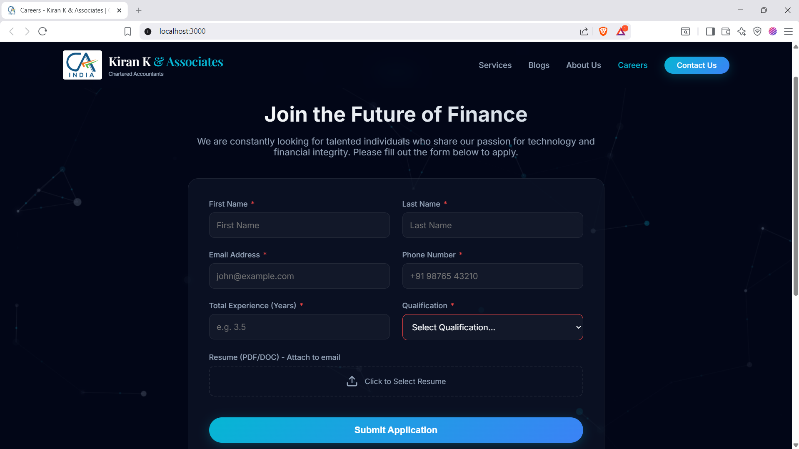

# Kiran K & Associates

<div align="center">

**Chartered Accountants | Forensic Analytics | AI Automation | Information System Security**

[](https://react.dev/)
[](https://www.typescriptlang.org/)
[](https://vitejs.dev/)

</div>

---

## 📋 About

Modern, responsive website for **Kiran K & Associates**, a forward-thinking Chartered Accountants firm based in India. The firm specializes in cutting-edge financial services including Forensic Analytics, AI-powered Automation, and Information System Security audits.

### ✨ Key Features

- **🎨 Modern Dark Theme** - Sleek, professional design with animated network background
- **📱 Fully Responsive** - Optimized for desktop, tablet, and mobile devices
- **📝 Markdown Blog System** - Easy-to-manage blog posts with YAML frontmatter
- **💼 Careers Portal** - Job application form with email submission
- **📧 Contact Form** - Direct inquiry submission via email
- **🔍 SEO Optimized** - Meta tags, Open Graph, and structured data
- **♿ Accessible** - Focus states, ARIA labels, keyboard navigation

---

## 📸 Screenshots

### Hero Section

*Landing page with animated network connector background*

### Services Section

*Core service offerings with modern card design*

### About Us 

*Company overview and team introduction*

### Blog

*Markdown-based blog system for industry insights* 

### Contact Form

*Professional contact form for client inquiries*

### Careers Page

*Job application portal with resume upload*

---

## 🛠️ Tech Stack

| Technology | Purpose |
|------------|---------|
| React 19 | UI Framework |
| TypeScript | Type Safety |
| Vite | Build Tool & Dev Server |
| CSS Variables | Design System |
| Markdown | Blog Content |

---

## 🚀 Getting Started

### Prerequisites
- Node.js 18+ 
- npm or yarn

### Installation

```bash
# Clone the repository
git clone https://github.com/KK-AuditX/kiran-k---associates.git

# Navigate to project directory
cd kiran-k---associates

# Install dependencies
npm install

# Start development server
npm run dev
```

The site will be available at `http://localhost:3000`

### Build for Production

```bash
npm run build
```

---

## 📁 Project Structure

```
kiran-k-associates/
├── index.tsx          # Main React application
├── index.css          # Global styles & CSS variables
├── index.html         # HTML template with SEO meta tags
├── blogParser.ts      # Markdown blog parser
├── blogs/             # Markdown blog posts
│   ├── 01-ai-forensic-audits.md
│   ├── 02-gst-saas-companies.md
│   └── 03-cybersecurity-balance-sheet.md
├── components/        # React components
│   ├── Icons.tsx
│   ├── NetworkConnectorBackground.tsx
│   └── ...
└── package.json
```

---

## 📝 Adding Blog Posts

Create a new `.md` file in the `blogs/` folder with YAML frontmatter:

```markdown
---
id: "unique-id"
title: "Your Blog Title"
excerpt: "Brief description..."
author: "Author Name"
date: "2026-02-15"
category: "Category"
imageUrl: "https://image-url.com/image.jpg"
---

Your blog content here...
```

---

## 📄 License

This project is proprietary software for Kiran K & Associates.

---

<div align="center">

**Kiran K & Associates** | Chartered Accountants

📍 Bengaluru, India | 📧 kiran@kka.co.in

</div>
